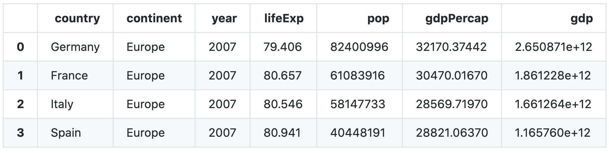

# Project 1

### •	Describe what is a package? Also, describe what is a library? What are the two steps you need to execute in order to install a package and then make that library of functions accessible to your workspace and current python work session? Provide examples of how you would execute these two steps using two of the packages we have used in class thus far. Be sure to include an alias in at least one of your two examples and explain why it is a good idea to do so.
A package is a directory having collections of modules as well as data such as versions and descriptions.   A library contains a collection of modules which can provide a wide range of related functionality. To make a library of functions accessible, the first step is to install the packages and the second step is to import the library and call specific functions. 
```python
#Example: 
import pandas as pd    
import numpy as np 
```
It’s a good ideas to use alias because the shorter term will make it easier to call and less likely to have a typo. 

### •	Describe what is a data frame? Identify a library of functions that is particularly useful for working with data frames. In order to read a file in its remote location within the file system of your operating system, which command would you use? Provide an example of how to read a file and import it into your work session in order to create a new data frame. Also, describe why specifying an argument within a read_() function can be significant. Does data that is saved as a file in a different type of format require a particular argument in order for a data frame to be successfully imported? Also, provide an example that describes a data frame you created. How do you determine how many rows and columns are in a data frame? Is there an alternate terminology for describing rows and columns? 

A data frame is like a spread sheet which store multiple variables, and have columns and rows. Pandas library is useful for working with data frames. 
```python
# Read a file and create a new data frame: 
import pandas as pd
data=pd.read_csv('path_to_file_object')

# If the data in file is not separated by comma, then a particular argument, sep='' is needed for the data frame to be successful imported.
# For example, for a tab separated file
data=pd.read_csv('path_to_file_object', sep='\t')

# Describe a data frame
data.describe()
# Determine numbers of rows and columns
data.shape
# An alternate way to determine numbers
data.size
```
### •	Import the gapminder.tsv data set and create a new data frame. Interrogate and describe the year variable within the data frame you created. Does this variable exhibit regular intervals? If you were to add new outcomes to the raw data in order to update and make it more current, which years would you add to each subset of observations? Stretch goal: can you identify how many new outcomes in total you would be adding to your data frame?
```python
import pandas as pd
data=pd.read_csv('gapminder.tsv', sep='\t')
data['year'].value_counts()
```
This variable exhibits regular intervals of 5 years. The latest year in the data frame is 2007, so in order to make it more current, I would add 2012 and 2017 to each subset of the observations. 

Stretch goal: 142*2=284 new outcomes in total would be adding to the data frame. 

### •	Using the data frame you created by importing the gapminder.tsv data set, determine which country at what point in time had the lowest life expectancy. Conduct a cursory level investigation as to why this was the case and provide a brief explanation in support of your explanation. 
```python
lowest_country=data[data['lifeExp']==data['lifeExp'].min()]
lowest_country
```
In 1992, Rwanda in Africa	has the lowest life expectancy of only 23.599 years. That's because a large scale civil war between the Rwandan Armed Forces and the rebel Rwandan Patriotic Front (RPF) occured in Rwanda between 1990 and 1994. Millions of people died from this war. 

### •	Using the data frame you created by importing the gapminder.tsv data set, multiply the variable pop by the variable gdpPercap and assign the results to a newly created variable. Then subset and order from highest to lowest the results for Germany, France, Italy and Spain in 2007. Create a table that illustrates your results (you are welcome to either create a table in markdown or plot/save in PyCharm and upload the image). Stretch goal: which of the four European countries exhibited the most significant increase in total gross domestic product during the previous 5-year period (to 2007)?
```python
data_4country_2007=data[(data['country'].isin(['Germany', 'France', 'Italy', 'Spain' ]))& (data['year']==2007)]
data_4country_2007.sort_values(by=['gdp'], inplace=True,ascending=False)
data_4country_2007.reset_index(inplace=True)
print(data_4country_2007)
```


Stretch goal: Germany exhibited the most significant increase in total gross domestic product. 

### •	You have been introduced to four logical operators thus far: &, ==, | and ^. Describe each one including its purpose and function. Provide an example of how each might be used in the context of programming.
```python
# '&' means 'and'. Both conditions need to be True to make an '&' statement True.
# For example: subsetting data for which continent is Europe and year is 1952.
new_df=data[(data['continent']=='Europe')&(data['year']== 1952)]

# '==' means equivalence and it is used to evaluate whether objects on the two sides are equal to each other
# For example: compare whether 1+1 equals 2
1+1==2

# '|' means 'inclusive or'. Either one of the conditions is ture or both statements are true can make an '|' statement True.
# For example: subsetting data for which either continent is Europe or year is 1952 or both are true. 
new_df=data[(data['continent']=='Europe')|(data['year']== 1952)]

# ^ means 'exclusive or'. Only either one of the conditions can make an '^' statement True.
# For example: subsetting data for which either continent is Europe or year is 1952.
new_df=data[(data['continent']=='Europe')^(data['year']== 1952)]

```

### •	Describe the difference between .loc and .iloc. Provide an example of how to extract a series of consecutive observations from a data frame. Stretch goal: provide an example of how to extract all observations from a series of consecutive columns.
.iloc fetches rows and columns by thier integer positions while .loc  fetches the rows and columnms by their labels(index of data frame).
```python
# Example 1: extracts consecutive obervations (rows) with integer positions from 0 to 10
data.iloc[0:11]

# Stretch goal example: extracts columns with integer positions from 0 to 4
data.iloc[:,0:5]
```
### •	Describe how an api works. Provide an example of how to construct a request to a remote server in order to pull data, write it to a local file and then import it to your current work session.
API stands for Application Programming Interface and it is the software intermediary that delivers your request to the provider which you're requesting from and then delivers the response back to you.
```python
# Example:
import os
import requests
import pandas as pd

url = "https://api.covidtracking.com/v1/states/daily.csv"
r = requests.get(url)
with open(file_name, 'wb') as f:
  f.write(r.content)
data = pd.read_csv(file_name)
```

### •	Describe the apply() function from the pandas library. What is its purpose? Using apply() to various class objects is an alternative (potentially preferable approach) to writing what other type of command? Why do you think apply() could be a preferred approach?
The apply() function helps to sumbit each item from the series or data frame as an argument to the specified function. Using apply() to various class objects is an alternative to writing a loop to submit each item to the function，but using the apply() function will be the easier way. This is why apply() could be a preferred approach. 

### •	Also describe an alternative approach to filtering the number of columns in a data frame. Instead of using .iloc, what other approach might be used to select, filter and assign a subset number of variables to a new data frame?
The other approach is to passing a list including selected column names to the data frame. 
```python
# Example:
new_df=data[['country','continent','year']]
```
