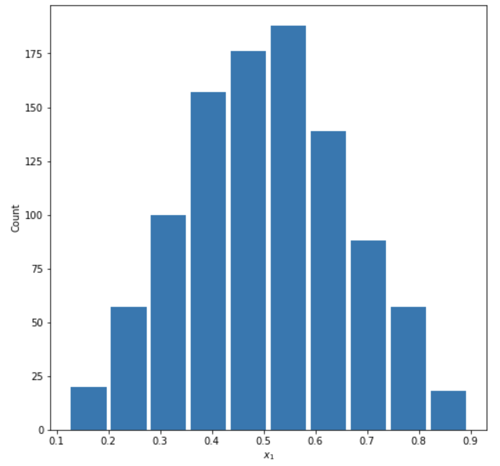
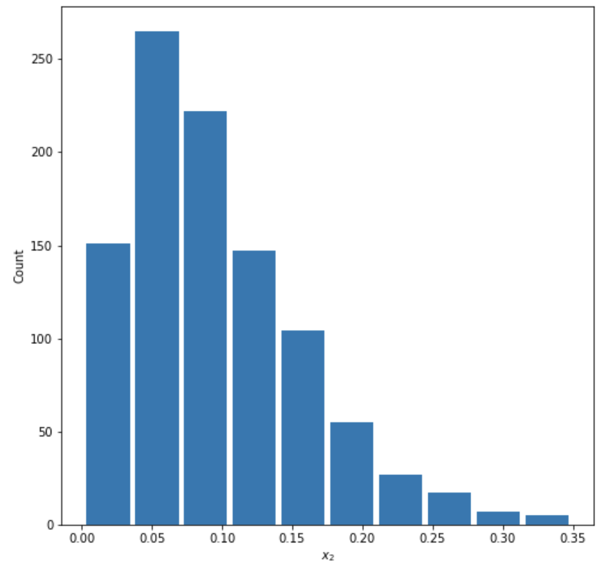
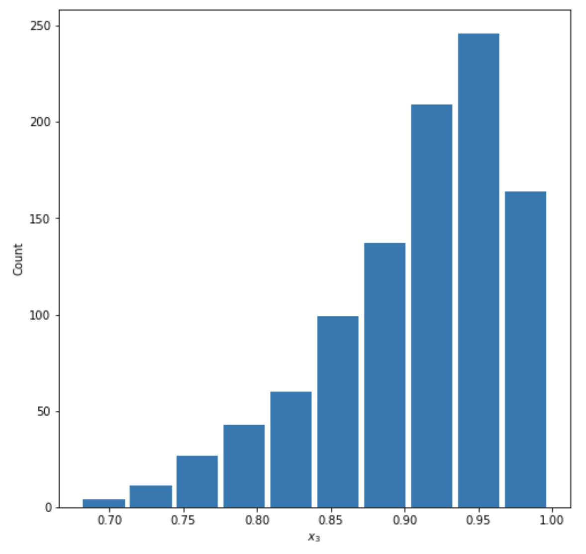
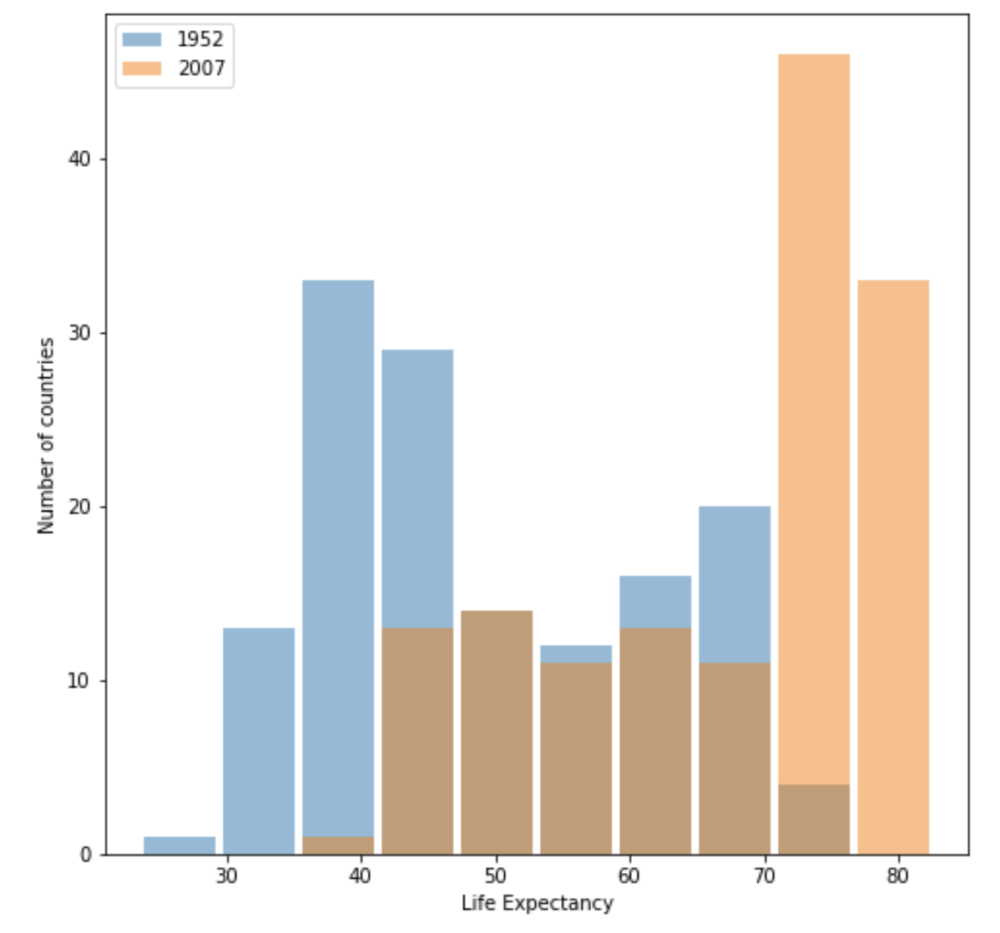
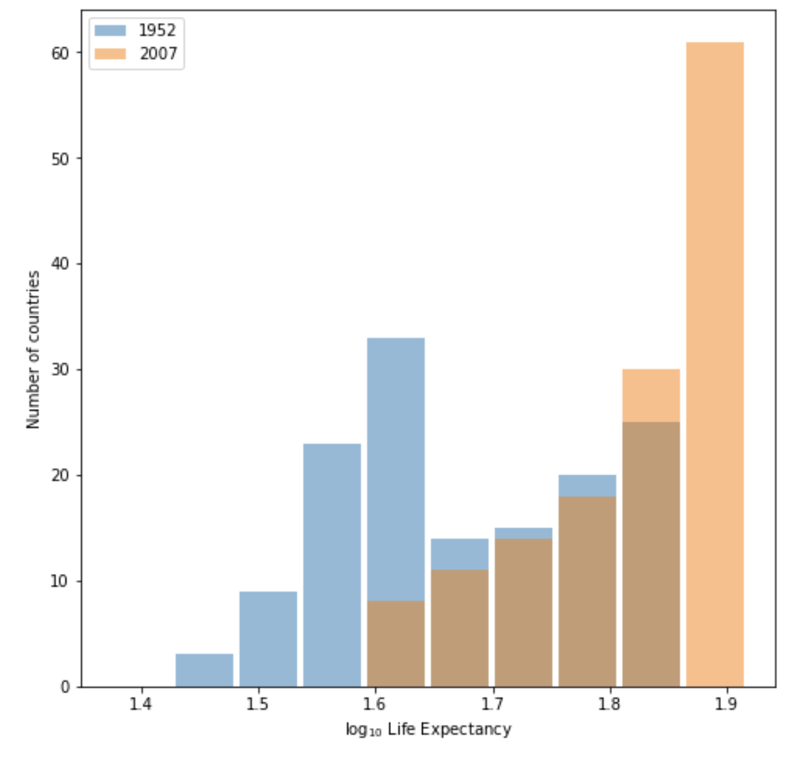
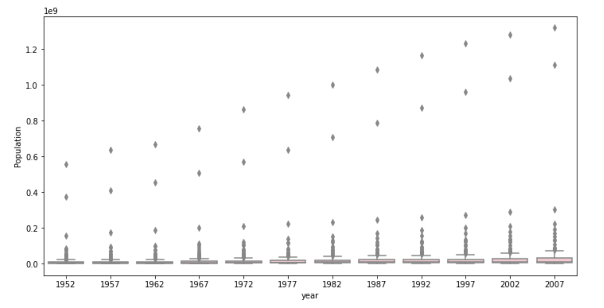
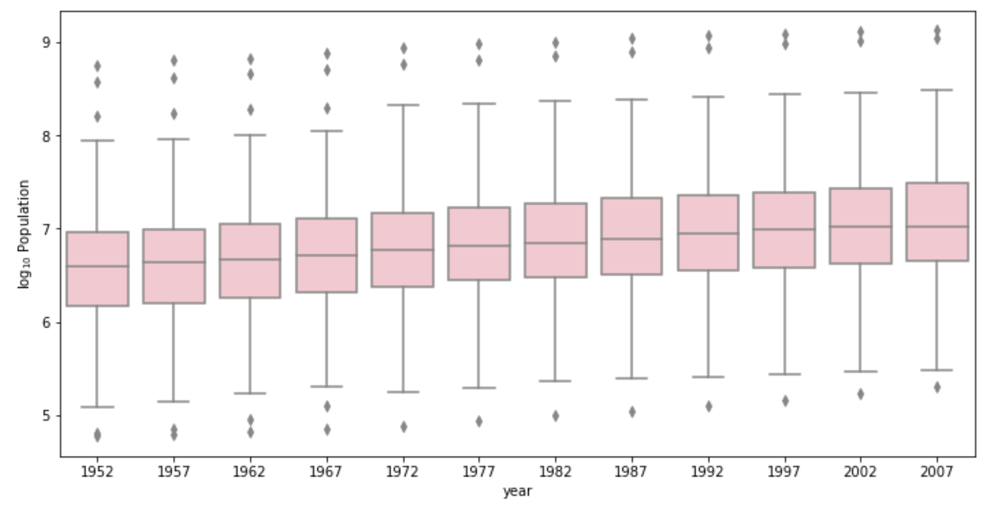

# Project 2

### - Describe continuous, ordinal and nominal data. Provide examples of each. Describe a model of your own construction that incorporates variables of each type of data. You are perfectly welcome to describe your model using english rather than mathematical notation if you prefer. Include hypothetical variables that represent your features and target.

Continuous data is numerical data that can take on a range of values. Example: temperature, income, or someone's height. 
Ordinal data is also numerical data, but unlike continuous data, only the order of ordinal values is important rather than their difference. Example: athletic ranking 
Nominal data is categorical like labels. Example: country, color, or  gender. 

A model that incorporate all types of data: result of a 50-meter dash on the Olympic Games. The country atheletes are from is nominal data. Athele's running time result is a continuous data. The ranking of their performance is ordinal data. In this model, the country and running time are features while the rank is the target which obviously depends on the running time.

|Athlete Name|Country|Time| Rank|
|------------|:-----:|:--:|----:|
|Athlete A           |    |    |     |
|Athlete B           |    |    |      |         
|Athelete C           |    |    |      | 

### - Comment out the seed from your randomly generated data set of 1000 observations and use the beta distribution to produce a plot that has a mean that approximates the 50th percentile. Also produce both a right skewed and left skewed plot by modifying the alpha and beta parameters from the distribution. Be sure to modify the widths of your columns in order to improve legibility of the bins (intervals). Include the mean and median for all three plots.

### Symmetric: 

Mean= 0.5042389951787236

Median= 0.504401068527123

### Right Skewed:

Mean=0.09593092764661984

Median=0.08272532110992745

### Light Skewed:

mean=0.906886211618868

median=0.9201854902191089
### - Using the gapminder data set, produce two overlapping histograms within the same plot describing life expectancy in 1952 and 2007. Plot the overlapping histograms using both the raw data and then after applying a logarithmic transformation (np.log10() is fine). Which of the two resulting plots best communicates the change in life expectancy amongst all of these countries from 1952 to 2007?

### Raw data plot:

### Plot after logarithmic transformation:

I think the row data plot best communicates the change in life expectancy from 1952 to 2007 and we can easily compare the life expecancy change on it. There is no need to apply a logaristhmic transformation.

### - Using the seaborn library of functions, produce a box and whiskers plot of population for all countries at the given 5-year intervals. Also apply a logarithmic transformation to this data and produce a second plot. Which of the two resulting box and whiskers plots best communicates the change in population amongst all of these countries from 1952 to 2007?

### Raw data plot:

### Plot after logarithmic transformation:

The plot after logarithmic transformation best communicates the change in population as it clearly shows the increasing trend of population on average. Because of several huge outliers, the boxplot drawn from raw data is difficult to read.
