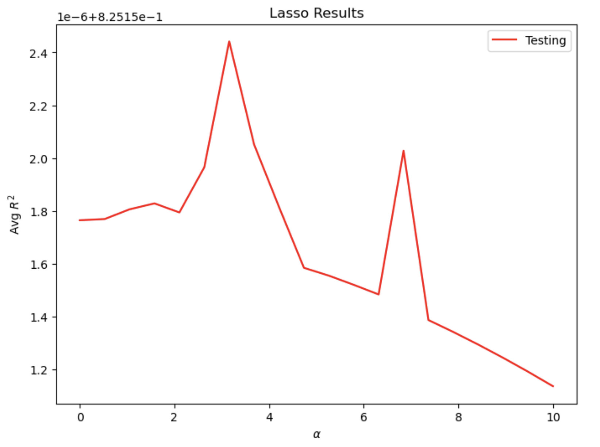

# Project 5 - Part 1

## 1
I first imported all the necessary libraries and read the persons.csv file as a dataframe. Then I dropped all the null values and convert values from "age" and "edu" columns to integers. Variables "wealthC" and "wealthI" are selected as two different targets, respectively stored in y1 and y2. All other variables are selected as features and stored in X. 

## 2
For linear regression performed without standardizing features, the training MSE is 0.4427858616687968 and the testing MSE 0.44375686734675845. The training R^2 is 0.7358365784782854 and testing R^2 is 0.7350536560539935. All the coefficients are listed below: 
```python
[ 2.98970945e-02  9.67390196e-03 -6.38467524e-04  8.43055863e-02
  3.76762978e-02  6.37043200e-02 -1.44625881e-01  1.04798398e-01
  1.87652675e-01 -2.56443037e-01 -2.39624286e-01 -7.49413493e-02
  3.13537183e-01 -1.29375716e-01  3.46372019e-01  2.36045366e-01
 -1.31767622e-01 -1.93088554e-01 -1.19919815e-01  4.02182375e-02
  1.43444074e-01 -1.83662312e-01  1.08564479e-01  3.91654133e-01
  1.71336248e-01  1.25008948e-02  1.03047674e-01 -1.22829684e-01
 -2.13411012e-01 -2.96695286e-01 -3.84816959e-01 -3.41312726e-01
  2.97115684e-01  2.12661232e-02  2.53580431e-01  3.90390110e-01
  3.59515489e-01  1.91557667e-01  3.95876607e-01  1.49877776e-01
 -2.44680391e-02  5.98656063e-02 -1.28187885e-01 -5.40840495e-01
 -5.61757796e-01 -1.46994818e-01 -1.12933617e-01 -3.19006051e-02
 -3.24323668e-01  3.24323668e-01 -6.12257088e-02  6.12257088e-02
 -2.61066540e-01  4.30192552e-01  6.05330241e-02  4.01997751e-01
 -6.47088457e-01  1.54316701e-02 -2.47015887e-01  2.47015887e-01]
```
For linear regression performed with standardizing features, the training MSE is 0.4427945482293184 and the testing MSE 0.4437350936808688. The training R^2 is 0.7358313931567183 and the testing R^2 is 0.7350665348612118. All the coefficients are listed below: 
```python
[ 1.11905627e-01  4.78233225e-03 -1.27413909e-02  6.95635498e-02
  1.14744270e+10  1.34766720e+10  1.19310172e+10  1.22969878e+10
  1.31383211e+10  1.22562481e+10  1.22743758e+10  1.36219238e+10
  1.34566100e+10  1.32926103e+10  1.80992514e+10  1.57257566e+10
  1.19028215e+10  1.16982687e+10  1.27277352e+10 -3.09307414e+11
 -4.67270580e+11 -5.06254246e+11  4.50837491e+09  4.48330779e+09
  8.17118056e+09  9.46024653e+09  4.89441156e+10  2.42046781e+10
  1.03132741e+10  1.50284121e+10  4.29490124e+10  3.04456255e+09
  5.28989383e+09  8.29323657e+09  1.08160570e+10  9.98540548e+10
  4.30255894e+11  1.65580843e+11  7.93708083e+10  3.18168869e+10
  6.48331531e+11  3.91920830e+11  4.23031945e+11  8.19498692e+11
  3.36357003e+10  4.87925343e+10  3.08850999e+11  6.35980851e+10
  1.15803871e+11  1.15803871e+11 -9.12158008e+10 -9.12158008e+10
  1.01274274e+10  4.82896394e+09  9.41193511e+09  1.98545575e+11
  1.99838807e+11  2.84338320e+10  2.00758027e+10  2.00758027e+10]
```
Comparing the results from linear regression models with and without standardization, we can see that standardization has no big impact on both MSE and R^2, which means it does not improve the prediction. However, coefficients changes significantly as the absolute values of most coefficients increase by about 10^10 after standardization.

## 3
For the Ridge regression, at the optimal alpha value of 175.263158, the R^2 training score is 0.7358493784953863 and the R^2 testing score is 0.7351236991279391. It seems that both scores are similar to those from the linear regression model and there is no big improvement. 

## 4
For the Lasso regression, after many convergence warnings, I finally got the results. At the optimal alpha value of 0.000263, the R^2 training score is 0.7358489661514309 and the R^2 testing score is 0.7351234674610403. It is also similar to results from both linear regression and ridge regression model. 

## 5
After choosing "wealthI" as the target, I ran the previous three regression models again. For linear regression performed without standardizing features: the training MSE is 1750165639.7899222 and the testing MSE 1754642088.3005753. The training R^2 is 0.8258372599154002 and testing R2 is 0.825019735491136. All the coefficients are listed below: 
```python
[ 2.30123282e+03  9.94929395e+02 -5.49723912e+01  6.55782229e+03
  2.90223788e+03  4.02921426e+03 -1.01608378e+04  1.13805316e+04
  1.03287330e+04 -1.66626913e+04 -1.66864255e+04 -6.07653121e+03
  2.10853142e+04 -9.24979039e+03  2.36188773e+04  1.37782705e+04
 -6.66870781e+03 -1.25497374e+04 -9.06845745e+03  5.81899128e+03
  7.76087738e+03 -1.35798687e+04  1.72835773e+04  3.18416826e+04
  5.63318477e+03 -2.51061686e+02  2.52682523e+03 -1.32874294e+04
 -1.24507897e+04 -2.80897543e+04 -2.96514478e+04 -2.26838835e+04
  2.21049382e+04 -4.52846449e+03  3.15526227e+04  3.97095496e+04
  3.70112796e+04  1.02333085e+04  4.80420177e+04  9.99393423e+03
 -1.06891032e+04 -8.67400906e+03 -1.85590353e+04 -4.59677401e+04
 -3.22690281e+04 -6.98984403e+03 -1.56866970e+04 -6.15463285e+03
 -3.45652523e+04  3.45652523e+04 -3.19741180e+04  3.19741180e+04
  3.02606945e+03  5.89630741e+04  2.31766126e+04  8.87916911e+03
 -6.88870165e+04 -2.51579087e+04 -2.24429956e+04  2.24429956e+04]
 ```
For the linear regression performed with standardizing features: the training MSE is 1750203430.1336277 and the testing MSE 1754574500.4267018. The training R^2 is 0.8258334955101793 and the testing R^2 is 0.8250261430577185. All the coefficients are listed below: 

```python
[ 8.62489797e+03  4.96973974e+02 -1.10859105e+03  5.41434032e+03
  1.25658383e+15  1.47585305e+15  1.30658579e+15  1.34666384e+15
  1.43879967e+15  1.34220238e+15  1.34418757e+15  1.49175982e+15
  1.47365602e+15  1.45569614e+15  1.98207950e+15  1.72215409e+15
  1.30349803e+15  1.28109710e+15  1.39383572e+15 -3.41491966e+16
 -5.15891769e+16 -5.58931826e+16  4.91876903e+14  4.89142007e+14
  8.91499724e+14  1.03214060e+15  5.33994632e+15  2.64080125e+15
  1.12520840e+15  1.63964377e+15  4.68586301e+15  3.32170689e+14
  5.77142905e+14  9.04816392e+14  1.18006349e+15  1.10179524e+16
  4.74746766e+16  1.82702830e+16  8.75781948e+15  3.51069313e+15
  7.15372646e+16  4.32447641e+16  4.66775819e+16  9.04239451e+16
  3.71138203e+15  5.38379559e+15  3.40787924e+16  7.01744837e+15
  1.27786091e+16  1.27786091e+16 -1.00655842e+16 -1.00655842e+16
  1.11751861e+15  5.32855663e+14  1.03856707e+15  2.19086610e+16
  2.20513636e+16  3.13755261e+15  2.21512928e+15  2.21512928e+15]
 ```
Both results from linear regression models with and without standardization are similar again, suggesting a minimal influence of standardization on the results. Coefficients also change significantly this time as the absolute values of most coefficients increase by about 10^10 after standardization. Both training and testing R^2 scores improve compared to those using "wealthC" as the target while the MSE become really huge, which may not be a good sign. 

For the Ridge regression, at the optimal alpha value of 140.263158, the R^2 training score is 0.8258461945313584 and the R^2 testing score is 0.8251526444362514. 

For the Lasso regression, again there appear many convergence warnings. At the optimal alpha value of 3.157895, the R^2 training score is 0.8258470314163497 and the R^2 testing score is 0.8251524416080761. It seems that all three models produce similar testing results again. 

## 6 
Using all the R^2 testing scores for comparison, the model using Ridge regression and “wealthI” as the target produces the best results in predicting wealth of all persons throughout the smaller West African country. For the same target, all the models produce similar R^2 scores, same up to 3 decimal places, which suggests that there is no big difference among the predicative power of all three models for this dataset. 

Moreover, it is obvious that all the testing and training results for “wealthI” are much more better than the “wealthC”. This suggests all the features are more correlated with the “wealthI” than the “wealthC”. 

The following graphs show the distribution of R^2 testing scores for different alpha values, which assist the process of finding optimal alpha values. 

**Ridge regression for “wealthC”:** 

**Lasso regression for “wealthC”:** 

**Ridge regression for “wealthI”:** 

**Lasso regression for “wealthI”:**



