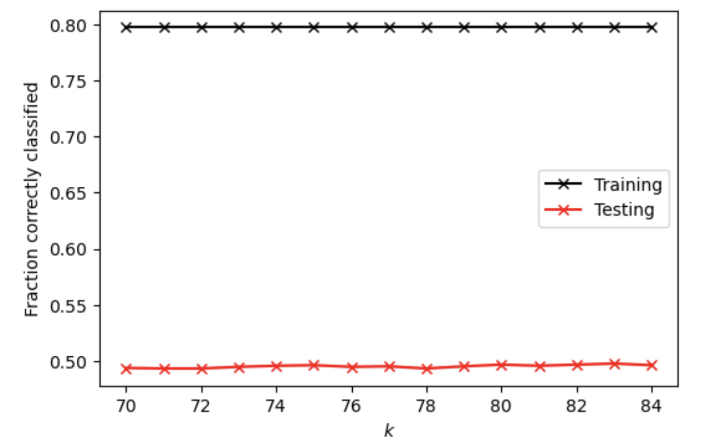

# Project 5 - Part 2

### 1. 
I first imported all the necessary libraries and read the city_persons.csv file as a data frame. Then I dropped all the null values and convert values from “age” and “edu” columns to integers. Variables “wealthC” are selected the target and stored in y. All other variables are selected as features and stored in X.

### 2. 
For K-nearest neighbors classification method without adding a distance weight, at optimal k value of 67, the testing score is 0.5485602733040508. All the training and testing scores at range (50, 80) are shown the plot below. 

For K-nearest neighbors classification method after adding a distance weight, at optimal k value of 83, the testing score is 0.4978038067349927. It seems that adding a distance weight even reduces the testing score. All the training and testing scores at range (70, 85) are shown the plot below. 

### 3. 
For the logistic regression model, the training score is 0.5465494791666666 and the testing score is 0.5558809175207419. Compared K-nearest neighbors classification method, the accuracy improves slightly but the overfitting problem of KNN no longer exists for logistic regression model. 

### 4. 
For the random forest model without standardization:  
When number of estimator = 100, the training score is 0.7962239583333334, and testing score is 0.4904831625183016.   
When number of estimator = 500, the training score is 0.7962239583333334, and testing score is 0.488530990727184.   
When number of estimator = 1000, the training score is 0.7962239583333334, and testing score is 0.49097120546608103.   
When number of estimator = 5000, the training score is 0.7962239583333334, and testing score is 0.49194729136163984.   
Generally, all the models produces similar result, but the specification of 5000 estimator returns slightly higher accuracy. From a range of (20, 30) for minimum number of samples to split, the number of 22 returns the best results with testing score at 0.5461200585651538. 

For the random forest model after standardization:    
When number of estimator = 100, the training score is 0.7962239583333334, and testing score is 0.49487554904831627.  
When number of estimator = 500, the training score is 0.7962239583333334, and testing score is 0.4958516349438751.   
When number of estimator = 1000, the training score is 0.7962239583333334, and testing score is 0.4997559785261103.  
When number of estimator = 5000, the training score is 0.7962239583333334, and testing score is 0.4997559785261103.  

### 5. 
After recoding the wealth classes 2 and 3 into a single outcome, I tested all the previous models.

For K-nearest neighbors classification method without adding a distance weight, at optimal k value of 77, the testing score is 0.5514885309907271. All the training and testing scores at range (50, 80) are shown the plot below. 

For K-nearest neighbors classification method after adding a distance weight, at optimal k value of 83, the testing score is 0.5217179111761835. It seems that adding a distance weight even reduces the testing score. All the training and testing scores at range (70, 85) are shown the plot below. 

For the logistic regression model, the training score is 0.5465494791666666 and the testing score is 0.5627135187896535. Compared K-nearest neighbors classification method, the accuracy of logistic regression model also improves slightly this time . 

For the random forest model without standardization:  
When number of estimator = 100, the training score is 0.7906901041666666, and testing score is 0.49633967789165445.  
When number of estimator = 500, the training score is 0.7906901041666666, and testing score is 0.49389946315275746.   
When number of estimator = 1000, the training score is 0.7906901041666666, and testing score is 0.4997559785261103.   
When number of estimator = 5000, the training score is 0.7906901041666666, and testing score is 0.4958516349438751.   
Generally, all the models produces similar result, but the specification of 1000 estimator returns slightly higher accuracy. From a range of (20, 30) for minimum number of samples to split, the number of 28 returns the best results with testing score at 0.5441678867740362. 

For the random forest model after standardization:     
When number of estimator = 100, the training score is 0.79296875, and testing score is 0.5017081503172279.  
When number of estimator = 500, the training score is 0.79296875, and testing score is 0.5061005368472425.  
When number of estimator = 1000, the training score is 0.79296875, and testing score is 0.513909224011713.   
When number of estimator = 5000, the training score is 0.79296875, and testing score is 0.5080527086383602.   

Recoding the wealth classes 2 and 3 into a single outcome does not change the testing accuracy significantly, but for all models, the testing accuracy increases slightly. Since classes 2 have considerably less observations than all other classes, aggregating it with class 3 may lead to more balanced numbers of classes, which may to some degree improve the model. 

### 6.
Despite of the fact that all the models produce similar testing accuracy, the logistic regression model after recoding classes 2 and 3 into a single one produces the best testing results of 0.5627135187896535 in predicting wealth of all persons throughout the large West African capital city being described. All three models improve slightly after the recoding while the logistic regression always produces slightly better results than other two models. It is also the only model without the overfitting problem as it produces similar training and testing score. 

